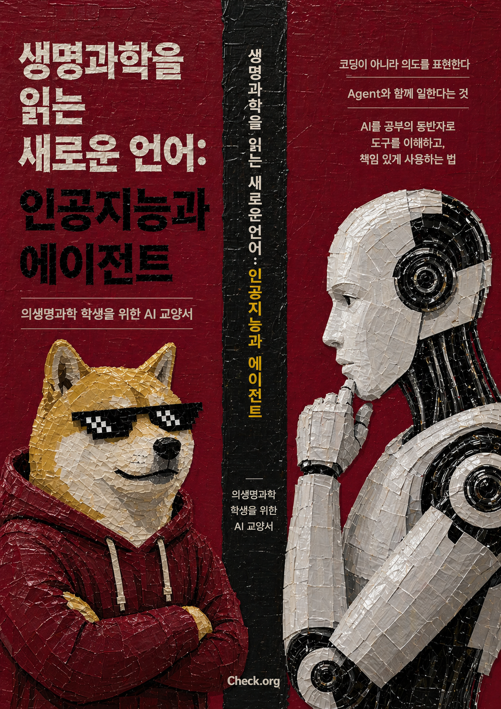

# 생명과학을 읽는 새로운 언어: 인공지능과 에이전트

안준용 
고려대학교 보건과학대학 바이오시스템의과학부

  

---

이 책은 고려대학교 보건과학대학 바이오시스템의과학부 1학년 세미나에서 학생들과 함께 읽기 위해 준비한 글입니다. 갓 대학에 들어온 학생들이 ChatGPT와 LLM을 단순한 검색창이나 과제 도구로만 보지 않고, 앞으로의 공부와 연구 환경을 바꾸는 중요한 기술로 이해할 수 있기를 바라는 마음에서 시작했습니다.

첫 독자는 대학 신입생이지만, 이 책은 중학교 과학 교실, 과학책 독서 모임, 과학 다큐멘터리 기획 회의에서도 함께 읽을 수 있습니다. 전문 연구자가 아니어도 괜찮습니다. 중요한 것은 모델 이름을 많이 아는 일이 아니라, AI가 만든 문장을 한 문장씩 붙들고 "무엇을 보았기에 이렇게 답했나", "이 말은 어디서 확인할 수 있나", "내가 모르는 용어는 무엇인가"를 묻는 태도입니다.

본문은 안드레이 카파시의 공개 강의와 인터뷰를 중요한 출발점으로 삼습니다. 다만 강의록을 그대로 옮긴 번역본은 아닙니다. 카파시가 설명한 LLM의 큰 흐름과 직관을 바탕으로, 의생명과학을 처음 배우는 한국어 독자가 강의자료와 실습 데이터에서 출발해 나중에는 논문, 코드, AI 도구까지 함께 생각할 수 있도록 다시 풀어 쓴 해설서입니다.

이 책은 먼저 생명과학을 배우는 화면과 작업대가 AI와 데이터, 에이전트로 어떻게 바뀌고 있는지 살펴봅니다. 그다음 ChatGPT가 답을 만들어내는 원리, 이 모델이 잘하는 일과 자주 틀리는 일, 자료와 도구를 함께 주었을 때 달라지는 점, 그리고 학생이 책임 있게 사용하는 방법을 차례로 다룹니다. 자세한 문제의식은 다음 [서문](getting-started.md)에 이어서 적었습니다.
